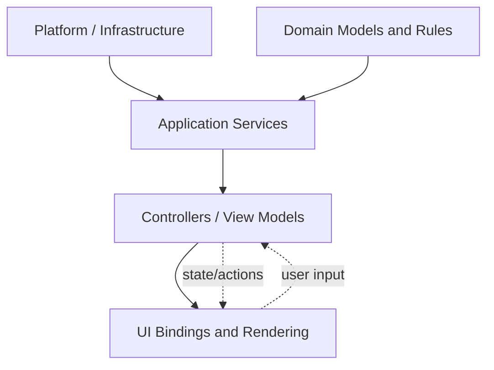

# Architecture

## Purpose

This section documents the architectural intent behind Nrgy.js.

## Core Idea

The central architectural goal is simple: business logic must be able to live
independently of UI technology.

That means:

- UI should render and forward user intent
- controllers and services should own workflows
- domain logic should not depend on React components
- platform integrations should stay replaceable

## Layered View

Typical layers in an Nrgy-based application:

1. Platform and infrastructure
2. Domain models and domain rules
3. Application services and orchestration
4. Controllers or view models
5. UI bindings and rendering

- `Platform` and `Domain` should not depend on UI.
- `Controllers / View Models` are the boundary between business logic and presentation.
- `UI` renders state and sends user intent back as actions.

## Why Logic Should Live Outside UI

Keeping too much logic inside UI components usually leads to "fat components".
They tend to mix rendering, state transitions, service calls, subscriptions,
and workflow decisions in one place.

That creates predictable problems:

- business rules become tied to a specific rendering technology
- the same feature logic is hard to reuse in another view
- tests have to go through UI setup instead of targeting the logic directly
- lifecycle and cleanup become harder to reason about

The architectural goal is to keep UI focused on rendering and user input, while
controllers, view models, and services own behavior.

## Reusing Logic Across Views

One business-logic layer can serve several views.

Typical examples:

- one controller powers both a compact widget and a full screen
- one view model is rendered by different UI shells
- the same feature logic is reused in a headless or SDK-like integration

This makes migration between UI technologies less expensive and reduces the
amount of duplicated workflow code.

## Design Principles

- keep business decisions out of UI components
- expose small stable view-model contracts
- inject services instead of importing global singletons
- make creation and destruction visible

## Contracts Between Layers

Each layer should know only what it needs from the adjacent layer.

What the UI should know:

- which state fields it can render
- which actions it can trigger
- which view-facing props or controller outputs are public

What the UI should not know:

- how services are wired
- how domain workflows are orchestrated
- how subscriptions, cleanup, and long-lived resources are managed internally
- infrastructure details that belong to application services or platform code

This is why small explicit contracts matter. They keep rendering code simple and
keep business logic portable.

## Related Sections

- [MVVM and Controllers](../mvvm/README.md)
- [Integrations](../integrations/README.md)
- [Recipes](../recipes/README.md)
