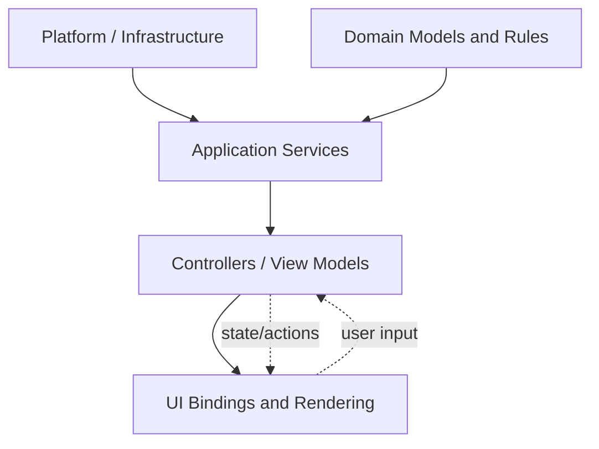

# Архитектура

## Назначение

Этот раздел описывает архитектурный замысел Nrgy.js.

## Главная идея

Главная архитектурная цель проста: бизнес-логика должна жить независимо от
UI-технологии.

Это означает:

- UI должен рендерить и передавать пользовательские намерения
- контроллеры и сервисы должны владеть workflow
- доменная логика не должна зависеть от React-компонентов
- платформенные интеграции должны оставаться заменяемыми

## Слои приложения

Типичная схема для приложения на Nrgy.js:

1. Платформа и инфраструктура
2. Доменная модель и доменные правила
3. Прикладные сервисы и orchestration
4. Controllers или view models
5. UI bindings и rendering

- `Platform` и `Domain` не должны зависеть от UI.
- `Controllers / View Models` являются границей между бизнес-логикой и представлением.
- `UI` рендерит состояние и отправляет пользовательское намерение назад через actions.

## Почему логика должна жить вне UI

Если слишком много логики держать внутри UI-компонентов, быстро появляются
"толстые компоненты". В них смешиваются rendering, state transitions, service
calls, subscriptions и workflow decisions.

Это приводит к предсказуемым проблемам:

- бизнес-правила привязываются к конкретной UI-технологии
- одну и ту же feature logic трудно переиспользовать в другом представлении
- тесты вынуждены идти через UI setup вместо прямой проверки логики
- lifecycle и cleanup становятся менее прозрачными

Архитектурная цель здесь такая: UI отвечает за rendering и user input, а
controllers, view models и services отвечают за поведение.

## Повторное использование логики

Один слой бизнес-логики может обслуживать несколько представлений.

Типичные примеры:

- один controller работает и для компактного виджета, и для полноценного
  экрана
- одна view model рендерится разными UI-оболочками
- одна и та же feature logic используется в headless или SDK-like сценарии

Это упрощает миграцию между UI-технологиями и уменьшает дублирование workflow
кода.

## Принципы проектирования

- не держать бизнес-решения в UI-компонентах
- наружу отдавать маленькие и стабильные view-model contracts
- сервисы инжектить, а не тащить через глобальные singleton-импорты
- делать создание и destruction видимыми в коде

## Контракты между слоями

Каждый слой должен знать только то, что ему действительно нужно от соседнего
слоя.

Что должен знать UI:

- какие поля состояния можно рендерить
- какие actions можно вызывать
- какие view-facing props или controller outputs являются публичными

Чего UI знать не должен:

- как именно сшиваются services
- как оркестрируются domain workflows
- как внутри устроены subscriptions, cleanup и long-lived resources
- детали инфраструктуры, относящиеся к application services или platform code

Именно поэтому важны маленькие и явные контракты. Они делают rendering code
простым, а бизнес-логику переносимой.

## Связанные разделы

- [MVVM и Controllers](../mvvm/README.ru.md)
- [Интеграции](../integrations/README.ru.md)
- [Рецепты](../recipes/README.ru.md)
