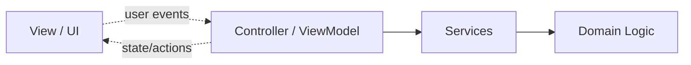

# MVVM and Controllers

## Purpose

This section explains how Nrgy.js structures UI-facing business logic.

## Why Controllers Exist

A controller lets you:

- create local feature state
- orchestrate side effects
- depend on services and external integrations
- expose a small API to the UI
- destroy everything through one lifecycle boundary

This is the main bridge from low-level reactivity to application architecture.

## Why MVVM Matters Here

In Nrgy.js, MVVM is not about a rigid framework-specific recipe. It is about
describing a stable contract between business logic and presentation.

The view:

- reads state
- calls actions
- does not own business workflows

The view model or controller:

- exposes state and actions
- does not depend on concrete rendering details
- may depend on services, params, or injected dependencies

- `View` renders state and forwards user intent.
- `Controller / ViewModel` owns presentation-facing business logic.
- `Services` and `Domain` stay outside the UI layer.

## MVC vs MVVM

For documentation purposes, the most useful distinction is this:

- in MVC, coordination and binding logic is usually explicit in the controller
- in MVVM, the view binds to a view-facing model and more of that connection is
  hidden behind the binding layer

In Nrgy.js terms:

- a controller is the main unit of feature logic
- a view model is a controller-shaped contract tailored for presentation
- both keep business logic outside the UI, but a view model puts more emphasis
  on the public view-facing surface

The point of this distinction is not historical purity. It is to explain where
view knowledge stops and business logic begins.

## Pages

- [Controllers](./controllers.md)
- [View Models](./view-models.md)

## Practical Guidance

- start with a controller when feature logic grows beyond local component state
- define the public contract first
- keep UI props and controller dependencies separate
- prefer simple declarations over clever abstractions
- when React views should consume a view model explicitly, prefer
  `withViewModel()` as an important MVVM integration point
