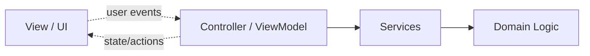

# MVVM и Controllers

## Назначение

Этот раздел объясняет, как Nrgy.js организует бизнес-логику, ориентированную на
UI.

## Зачем нужны controllers

Контроллер позволяет:

- создавать локальное состояние фичи
- оркестрировать сайд-эффекты
- зависеть от сервисов и внешних интеграций
- отдавать UI небольшой API
- уничтожать всё через одну lifecycle-границу

Это основной мост от низкоуровневой реактивности к архитектуре приложения.

## Почему здесь важен MVVM

В контексте Nrgy.js MVVM нужен не как жёсткий фреймворк-паттерн, а как способ
описать стабильный контракт между бизнес-логикой и представлением.

View:

- читает state
- вызывает actions
- не владеет бизнес-workflow

View model или controller:

- отдаёт state и actions
- не зависит от конкретной реализации рендера
- может зависеть от services, params и injected dependencies

- `View` рендерит состояние и передаёт пользовательское намерение.
- `Controller / ViewModel` владеет presentation-facing бизнес-логикой.
- `Services` и `Domain` остаются вне UI-слоя.

## MVC vs MVVM

Для документации наиболее полезно такое различие:

- в MVC координация и binding-логика обычно явно живут в controller
- в MVVM view привязывается к view-facing модели, и большая часть этой связи
  скрыта за binding layer

В терминах Nrgy.js:

- controller является основной единицей feature logic
- view model является controller-shaped контрактом, адаптированным для
  представления
- оба подхода держат бизнес-логику вне UI, но view model сильнее акцентирует
  публичную поверхность для view

Смысл этого различия не в исторической чистоте терминов, а в том, чтобы
объяснить, где заканчивается знание view и начинается бизнес-логика.

## Страницы

- [Controllers](./controllers.ru.md)
- [View Models](./view-models.ru.md)

## Практический ориентир

- начинать с controller, когда логика перерастает локальный component state
- сначала формулировать публичный контракт
- разделять UI props и зависимости контроллера
- предпочитать простые декларации сложным абстракциям
- когда React-view должна явно работать с view model, стоит предпочитать
  `withViewModel()` как важную точку MVVM-интеграции
